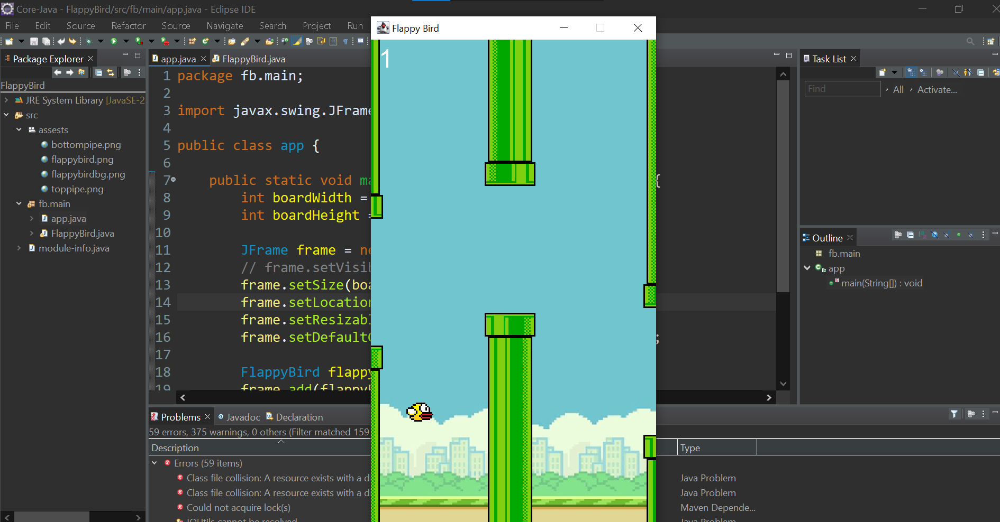
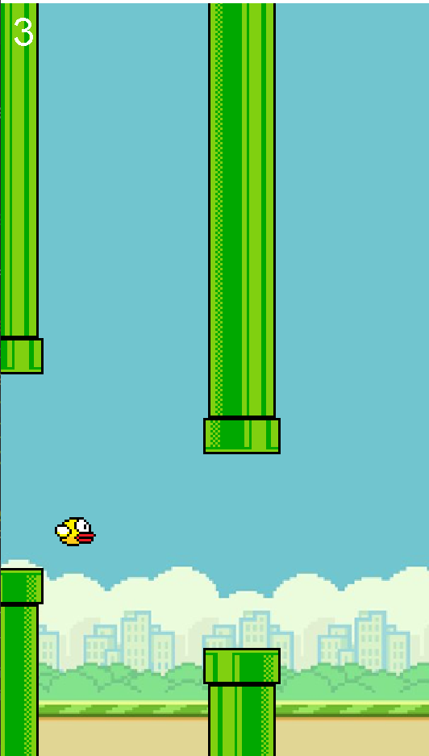

# **Flappy Bird 🐦**  

A simple **Flappy Bird** clone built in **Java Swing**. The game features a moving bird, randomly generated pipes, and a scoring system.  

## **📌 Features**
✅ Classic **Flappy Bird mechanics** (jumping, gravity, and collision detection)  
✅ **Procedurally generated pipes** with random gaps  
✅ **Score tracking**  
✅ **Game over detection** and restart functionality  
✅ **Smooth animations** with a game loop  

---

## **🚀 Technologies Used**
- **Java** (Core language)  
- **Swing** (`JFrame`, `JPanel`, `Graphics`) for rendering the game  
- **Timers** for handling game loops and animations  
- **Event Listeners** for handling keyboard input  

---

## **📂 Image Sample**
### **Gameplay Screenshot**

  

  

---
